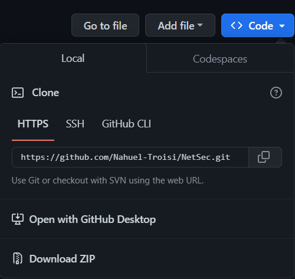
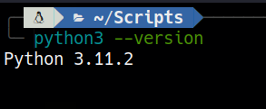
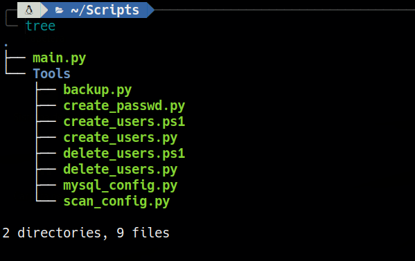

<p align="center">  </p>

## ¿Qué es NetSec?

El proyecto NetSec surge como una solución de automatización de procesos clave para mejorar la seguridad informática de las organizaciones. Se dirige a empresas que valoran la seguridad informática y desean mejorar la eficiencia y la consistencia de sus procesos de seguridad.

El objetivo general del proyecto es mejorar la seguridad informática de las organizaciones a través de la automatización de procesos clave, reduciendo errores humanos, mejorando la eficiencia y garantizando la consistencia en los procesos de seguridad.

## ¿Qué sistema operativo se necesita?

NetSec es una herramienta desarrollada en Python, por lo que ***puede ejecutarse en cualquier sistema operativo*** que tenga instalado Python.

Sin embargo, algunas de las funcionalidades de NetSec como la creación y eliminación de usuarios en Linux y Windows, dependen del sistema operativo donde se está ejecutando. 

NetSec ha sido probado en sistemas operativos como Linux (Ubuntu, Debian, Kali), Windows (Windows 10, Windows Server 2016) y macOS (Catalina, Big Sur).


## ¿Cómo puedo instalar esta herramienta?

Para instalar NetSec, sigue estos pasos:

1) Descarga el archivo .zip o clona el repositorio desde GitHub.

    

2) Asegúrate de tener Python 3 instalado en tu sistema.

    

3) Extrae el archivo .zip.

    

4) Asegúrate de tener los siguientes paquetes de Python instalados:
    
    - mysql.connector
    - getpass
    - request
    - xerox
    - nmap
    - prettytable

    Puedes hacerlo con el comando siguiente:

    ```
    pip install mysql-connector-python getpass requests xerox nmap prettytable
    ```

5) Dirígete al directorio ***Scripts***. 

6) Ejecuta el comando ***sudo python3 main.py*** para iniciar la aplicación.

    

Una vez iniciada la aplicación, podrás acceder a todas las herramientas y funciones que ofrece NetSec. Recuerda que debes tener los permisos necesarios en tu sistema y en la base de datos para poder utilizar todas las funcionalidades del programa.

## ¿Puede cualquier usuario tener acceso a esta herramienta?

No necesariamente cualquier usuario debería tener acceso a NetSec ya que esta herramienta está diseñada para ***usuarios avanzados*** que tienen conocimientos en seguridad informática y gestión de sistemas.

Algunas de las funcionalidades de NetSec requieren permisos de administrador en el sistema y la base de datos MySQL, por lo que es importante que solo los usuarios con los permisos adecuados tengan acceso a esta herramienta.

Además, NetSec tiene como objetivo ayudar a los administradores de sistemas y expertos en seguridad informática a gestionar y asegurar sus sistemas y bases de datos de manera más eficiente y efectiva. Si un usuario sin los conocimientos necesarios utiliza NetSec incorrectamente, puede causar daños en el sistema o comprometer la seguridad de la base de datos.

## ¿Es compatible la herramienta con todas las bases de datos?

NetSec es una herramienta diseñada específicamente para trabajar con bases de datos MySQL. Actualmente, NetSec utiliza la librería "mysql-connector-python" para conectarse y gestionar bases de datos MySQL a través de Python.

Sin embargo, dado que hay una variedad de sistemas de gestión de bases de datos disponibles, se están desarrollando nuevas herramientas que permitirán a NetSec trabajar con otros sistemas de gestión de bases de datos.

Esto significa que en el futuro, es posible que se lancen nuevas versiones de NetSec que sean compatibles con otras bases de datos, como PostgreSQL o MongoDB, por ejemplo.

## ¿Son fiables los resultados obtenidos en el escaneo de puertos?


## ¿Qué requisitos se necesitan para ejecutar esta herramienta?
